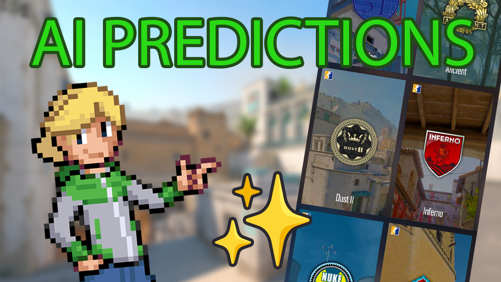
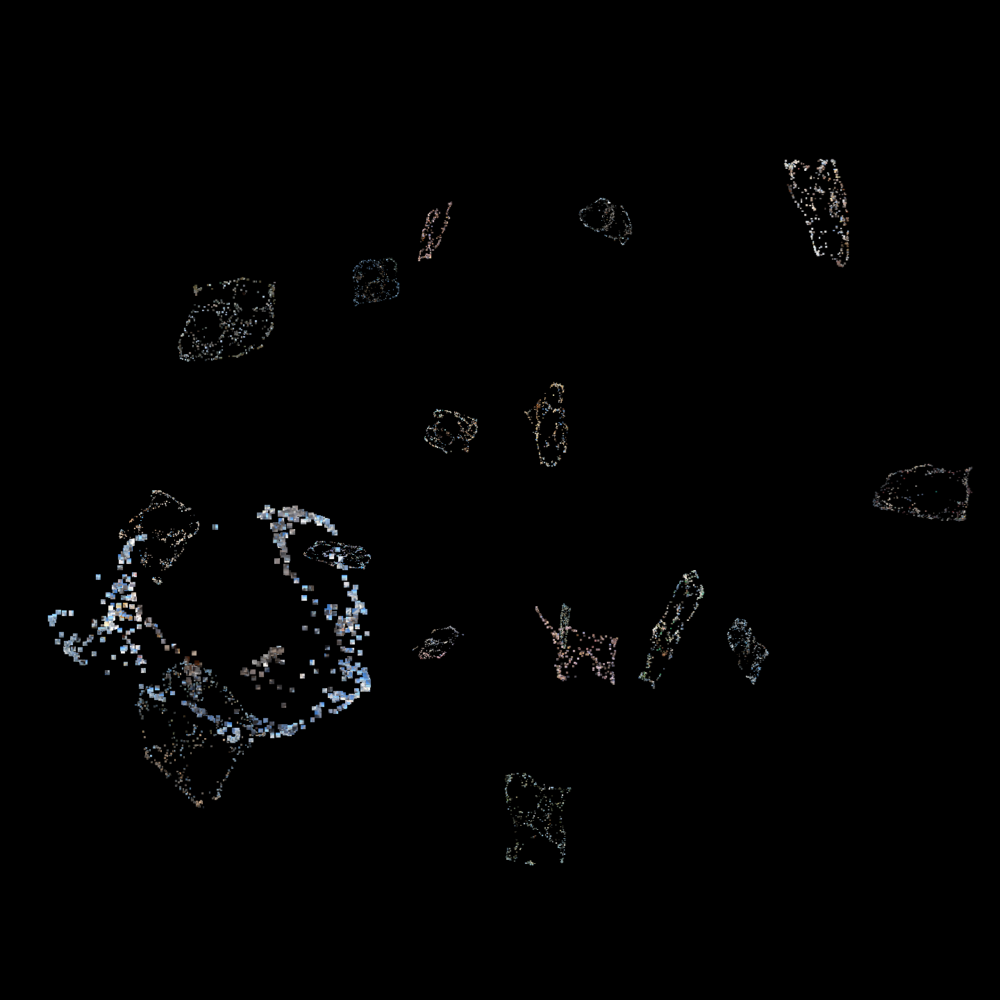
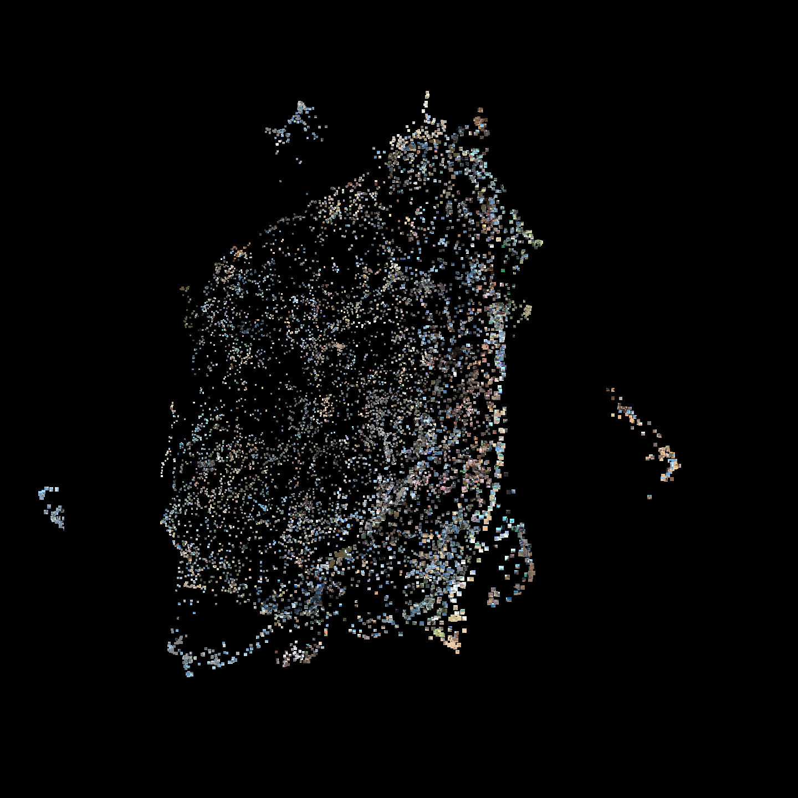

# Programming with Julius

Welcome to the official GitHub profile for **Programming with Julius**! Here, I share my coding projects and various AI experiments.

## Projects

### [I made an AI to predict Counter Strike 2 maps](https://www.youtube.com/watch?v=RmUy7bBO_dE)

This project involves using computer vision to predict the played map in Counter Strike 2. Check out the full video on YouTube!

### [Embedding viewer for UMAP 3D projections of my location-guessing AI for Counter Strike 2](https://cstrike.win/)
|  |  |
| --- | --- |

Explore the 3D projections of my location-guessing AI, using UMAP dimensionality reduction, directly on my website.

### [Counter-Strike 2 Map Location Dataset](https://github.com/Programming-with-Julius/CounterStrike2MapLocationDataset)
|  |  |
| --- | --- |
|  |  |

This dataset contains 1.7 million 1024x1024 images from 17 Counter-Strike 2 maps (August 2024). Each image has a label with:
- Mapname
- X, Y, Z (Camera location)
- Pitch, Yaw (Camera viewangles)

More info in the [Repository](https://github.com/Programming-with-Julius/CounterStrike2MapLocationDataset)

