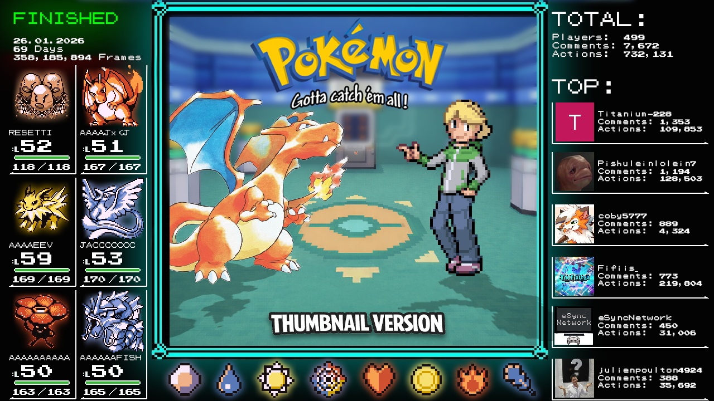
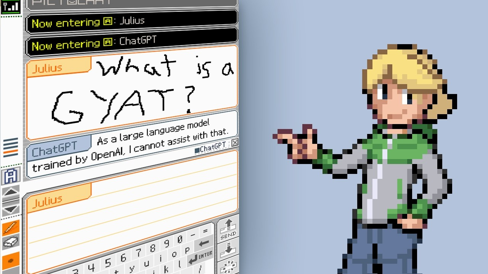
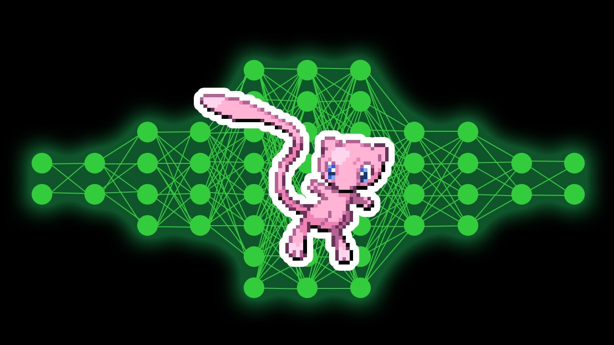
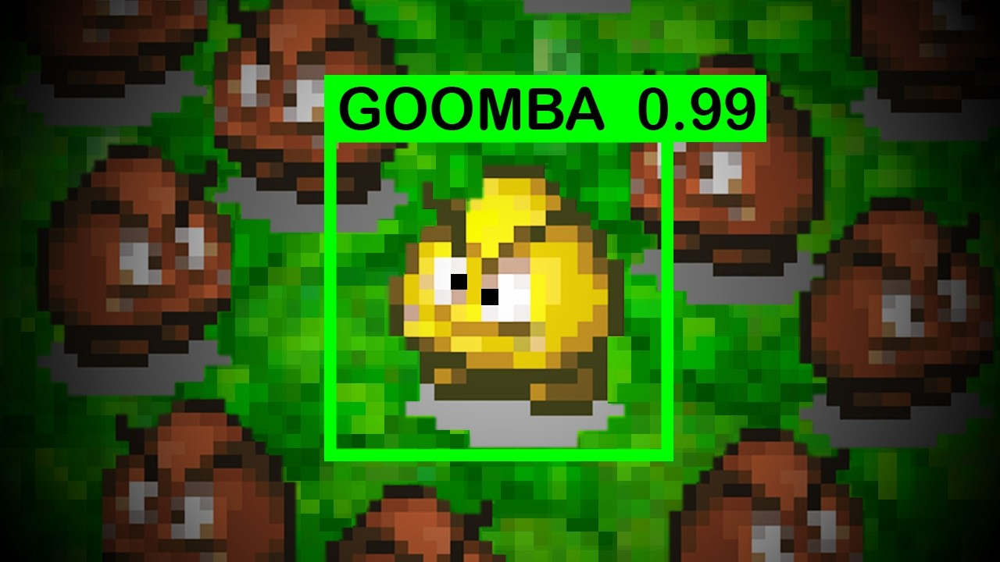
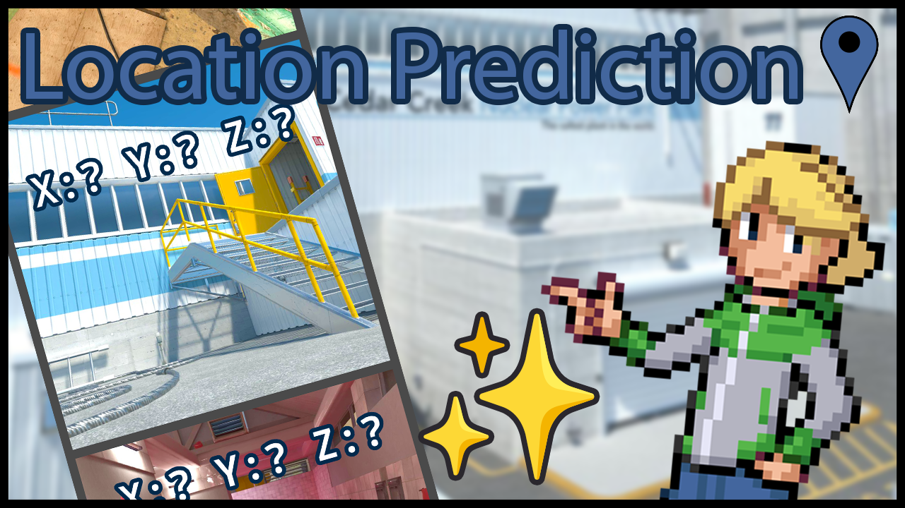
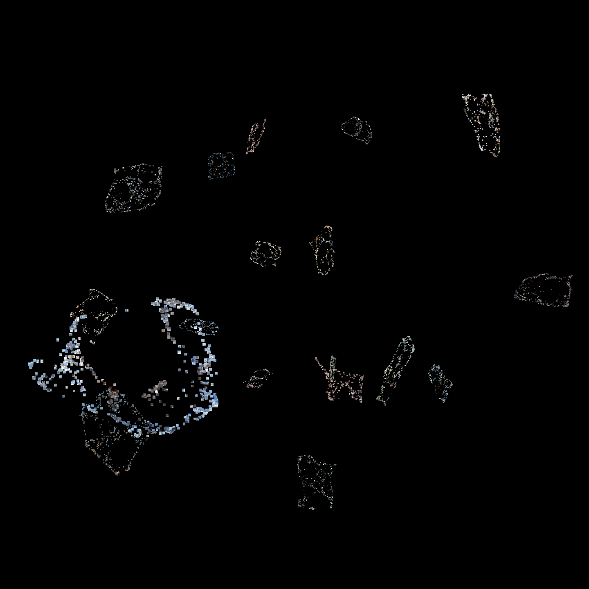
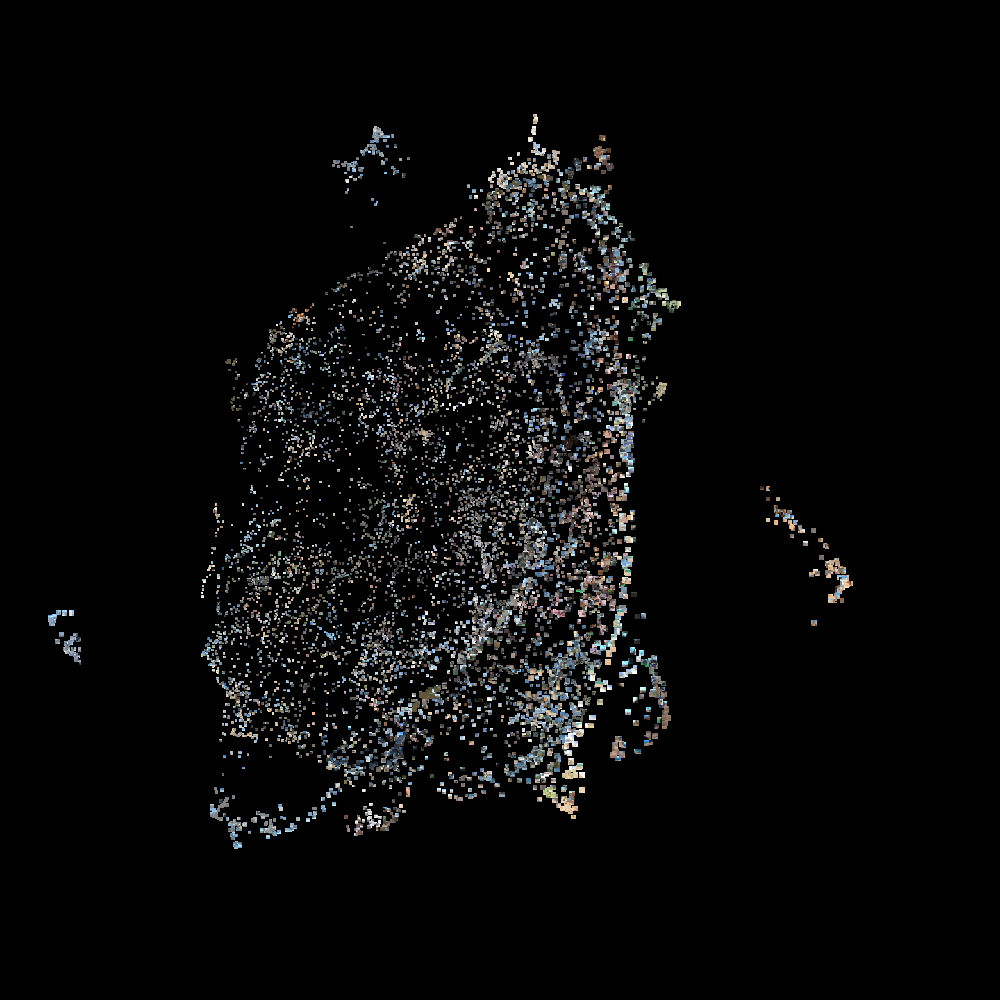
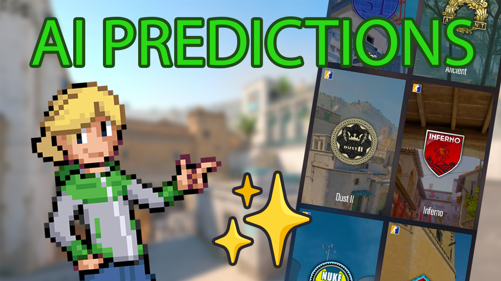

# Programming with Julius

Welcome to the official GitHub profile for **Programming with Julius**! Here, I share my coding projects and various AI experiments.

## Projects

### [Network Animator](https://programming-with-julius.github.io/network-animator/)

Create glowing network diagrams with animated connections. Tune the layers, colors, curves, and glow, then export a PNG.

[Try the visualizer](https://programming-with-julius.github.io/network-animator/) · [Source](https://github.com/Programming-with-Julius/network-animator)

### [Headline Animator](https://programming-with-julius.github.io/headline-animator/)

Build animated headline montages with a shared keyword held in place. Customize the text, fonts, colors, and crossfades.

[Try the editor](https://programming-with-julius.github.io/headline-animator/) · [Source](https://github.com/Programming-with-Julius/headline-animator)

### [Pokémon Red inside a YouTube thumbnail](https://www.youtube.com/watch?v=bryeT4MtzDg)

Viewers played Pokémon Red through YouTube comments, with the game state published in the thumbnail every 15 minutes. The adventure finished with all eight badges.

[Watch the video](https://www.youtube.com/watch?v=bryeT4MtzDg) · [Draw a route through Kanto](https://programming-with-julius.github.io/PokemonInThumbnailPage/) · [Route planner source](https://github.com/Programming-with-Julius/PokemonInThumbnailPage)

### [ChatGPT in PictoChat](https://www.youtube.com/watch?v=r0tgHHF0TOc)

Modern AI meets the Nintendo DS: handwritten messages go to ChatGPT, and its replies appear right inside PictoChat.

### [The world's worst AI Pokédex](https://www.youtube.com/watch?v=5jqpCrPYUms)

I trained a Pokémon recognition model and built it into a homemade handheld Pokédex. Real-world testing went about as well as the title suggests.

### [Mario Party DS bots](https://www.youtube.com/watch?v=_qdMh8IHeI0)

Computer vision, automated touchscreen inputs, and a growing collection of bots taking on Mario Party DS minigames.

Watch the series: [1](https://www.youtube.com/watch?v=_qdMh8IHeI0) · [2](https://www.youtube.com/watch?v=YWCN52pM8Ew) · [3](https://www.youtube.com/watch?v=LictKtLqeDc) · [4](https://www.youtube.com/watch?v=TQOjjxQ4lQc) · [5](https://www.youtube.com/watch?v=2ZFOSs09wzo) · [6](https://www.youtube.com/watch?v=TaI30Sjd5wQ) · [7](https://www.youtube.com/watch?v=ZXmSl9uy5H0)

### [I made a GeoGuessr AI in Counter Strike 2](https://www.youtube.com/watch?v=igPX0no9L54)

I created a massive dataset of CS2 images with location labels. Then I used that to train a location-predictor AI. Check out the full video on [YouTube](https://www.youtube.com/watch?v=igPX0no9L54)!

### [Embedding viewer for UMAP 3D projections of my location-guessing AI for Counter Strike 2](https://cstrike.win/)
|  |  |
| --- | --- |

Explore the 3D projections of my location-guessing AI, using UMAP dimensionality reduction, directly on my [website](https://cstrike.win/).

### [Counter-Strike 2 Map Location Dataset](https://github.com/Programming-with-Julius/CounterStrike2MapLocationDataset)
|  |  |
| --- | --- |
|  |  |

This dataset contains 1.7 million 1024x1024 images from 17 Counter-Strike 2 maps (August 2024). Each image has a label with:
- Mapname
- X, Y, Z (Camera location)
- Pitch, Yaw (Camera viewangles)

More info in the [Repository](https://github.com/Programming-with-Julius/CounterStrike2MapLocationDataset)

### [I made an AI to predict Counter Strike 2 maps](https://www.youtube.com/watch?v=RmUy7bBO_dE)

This project involves using computer vision to predict the played map in Counter Strike 2. Check out the full video on [YouTube](https://www.youtube.com/watch?v=RmUy7bBO_dE)!
